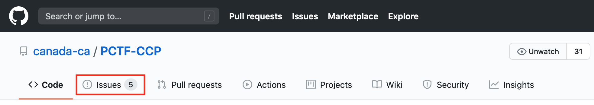
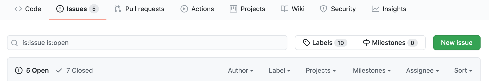
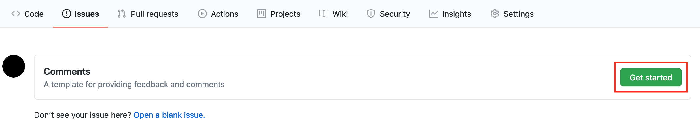

# Providing Feedback

**Review the documentation.** No account is needed to review the PCTF. Simply follow [this link](https://github.com/canada-ca/PCTF-CCP). However, if you wish to comment you must:

1. **Establish a GitHub account.** In order to submit a comment through the GitHub “Issues” feature, you will need to create a GitHub account. This can be done by proceeding to [https://github.com/join]. **For issues submitted on behalf of an organization, a generic account named for the organization is preferred, rather than a personal account from someone within the organization.**
2. **Open an issue.** As you are reading and identify comments you would like to make:
   1. Click on the "Issues" tab on the PCTF navigation bar.
   
   2. Review open and closed issues to determine if a similar issue has already been created.
   3. Click on the "New Issue" button in the upper right of the screen.
   
   4. Select the "Get Started" button for the Comment template
   
   5. Provide a consise summery of the feedback being provided in the "Title" section  
   6. Fill out the template and provide as much information as possible.
   7. Hit “Submit New Issue” and you are done!  
    

If you are familiar with GitHub you are also welcome to provide suggestions to concrete changes as a pull request (PR). We prefer PRs as follows:

1. Fork a copy of canada-ca/PCTF-CCP to your own organization/personal space.
2. Create a branch in your fork, named specifically for the edit you propose. PRs should be focused, rather than broad-sweeping updates.
3. Issue a PR from your branch to the `master` branch in canada-ca/PCTF-CCP.
4. If we intend to merge the PR, we may engage via PR reviews and request changes before completing the merge.

Please provide information about your organization and rationale for the suggested change.
