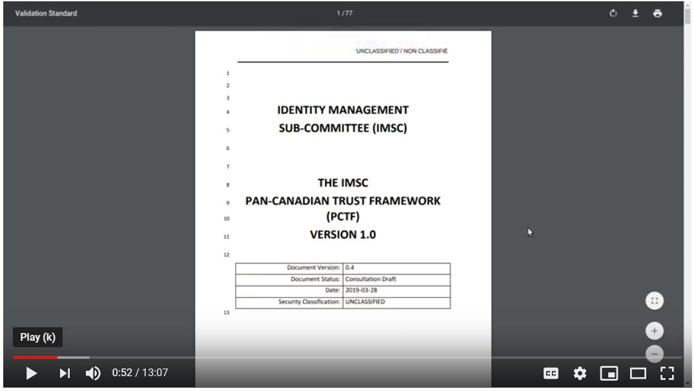

# Public Sector Profile of the Pan-Canadian Trust Framework | Cadre de Confiance pancanadien

## Overview

[Public Sector Profile of the Pan-Canadian Trust Framework](https://github.com/canada-ca/PCTF-CCP/tree/master/public-sector-profile)

A quick video overview of the document (will be updated shortly)

## Resources
Links to resources will be updated as they are developed and become available.

[Digital Identity and PCTF Overview April 2019](https://docs.google.com/presentation/d/13DAy18v5i063rGekaOoG4EioO1b3q3QMOmWJPkkBWxw/edit?usp=sharing)

See the [Government of Canada Trusted Digital Identity Presentation](https://docs.google.com/presentation/d/1Vu1st96Sx7npHv32LXy3HXP3-nVnB2N71amGd7dInxM/edit?usp=sharing)

Link to the one minute [video](https://youtu.be/0DMu8dLyTdQ)

[Link to this GitHub site](https://canada-ca.github.io/PCTF-CCP/)

The Pan-Canadian Trust Framework(PCTF) is designed for use by public and private sector services within the Canadian context. As the framework evolves, digital identities from other countries will be accepted, such as the [European eID](https://ec.europa.eu/digital-single-market/en/trust-services-and-eid).

* Read the short overview of the [Pan-Canadian Trust Framework](./overview/pctf-overview.md)

For a more complete overview of the Pan-Canadian Trust Framework, please visit the Digital ID & Authentication Council of Canada [DIACC](https://diacc.ca). For [Trust Services and eID](https://ec.europa.eu/digital-single-market/en/trust-services-and-eid).

To join us in collaborating, please register at [GCcollab](https://gccollab.ca) and join the group [here](https://gccollab.ca/bookmarks/group/6910/all).
