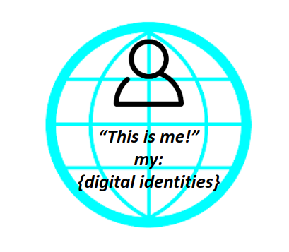

# Pan-Canadian Trust Framework | Cadre de Confiance pancanadien

## Project Goals

The goal of this project is to develop a formalized assessment, approval and accceptance process for a trusted digital identity accepted through the Pan-Canadian Trust Framework for use by public sector programs and services. As this process evolves, digital identities from other frameworks will be accepted, including the [European eID](https://ec.europa.eu/digital-single-market/en/trust-services-and-eid).

## Digital Identity Alpha Testing and Acceptance

A trusted digital identity will be formally accepted using the [Digital Identity Acceptance Statement](./assessment/digital-identity-acceptance-statement.md) which is currently in draft.

Acceptance will be based on the **Pan-Canadian Trust Framework**

* Read the short overview of the [Pan-Canadian Trust Framework](./overview/pctf-overview.md)

To learn more about the Pan-Canadian Trust Framework visit the Digital ID & Authentication Council of Canada [DIACC](https://diacc.ca)and [Trust Services and eID](https://ec.europa.eu/digital-single-market/en/trust-services-and-eid). To join us in collaborating register for [GCcollab](https://gccollab.ca) and join the group [here](https://gccollab.ca/bookmarks/group/6910/all).
