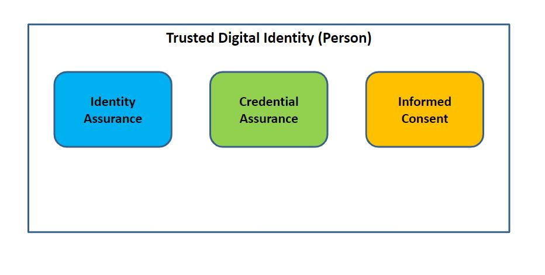
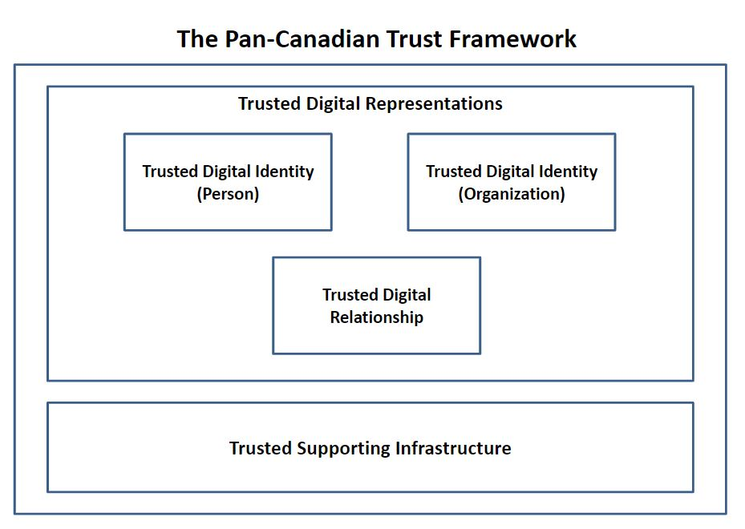

# Pan-Canadian Trust Framework | Cadre de Confiance pancanadien

## Overview

[IMSC Pan-Canadian Trust Framework Version 1.0 Consultation Draft](https://github.com/canada-ca/PCTF-CCP/blob/master/version1/release-notes.md)

[Video overview of the PCTF Document](https://youtu.be/2QzapDplJyA)

See the [Government of Canada Trusted Digital Identity Presentation](https://docs.google.com/presentation/d/1Vu1st96Sx7npHv32LXy3HXP3-nVnB2N71amGd7dInxM/edit?usp=sharing)

Link to the one minute [video](https://youtu.be/0DMu8dLyTdQ)

The Pan-Canadian Trust Framework(PCTF) is designed for use by public and private sector services within the Canadian context. As the framework evolves, digital identities from other countries will be accepted, such as the [European eID](https://ec.europa.eu/digital-single-market/en/trust-services-and-eid).

* Read the short overview of the [Pan-Canadian Trust Framework](./overview/pctf-overview.md)

For a more complete overview of the Pan-Canadian Trust Framework, please visit the Digital ID & Authentication Council of Canada [DIACC](https://diacc.ca). For [Trust Services and eID](https://ec.europa.eu/digital-single-market/en/trust-services-and-eid).

To join us in collaborating, please register at [GCcollab](https://gccollab.ca) and join the group [here](https://gccollab.ca/bookmarks/group/6910/all).
