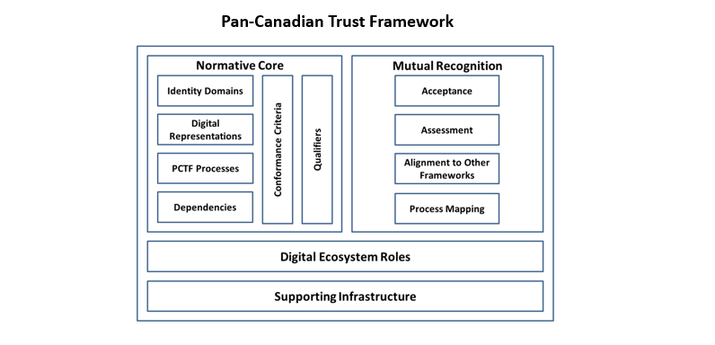

# Public Sector Profile of the Pan-Canadian Trust Framework | Cadre de Confiance pancanadien

Site is also available at [https://canada-ca.github.io/PCTF-CCP/](https://canada-ca.github.io/PCTF-CCP/)
## Overview

**Version 1.1** Consultation Draft for public review is now [available](Version1_1/)

Version 1.1 of the public sector profile of the <b>Pan-Canadian Trust Framework (PCTF)</b> is structured as follows:

* <b>Section 1</b> describes the purpose, stakeholders, and audience of the document
* <b>Section 2</b> describes the main elements of the PCTF 
* <b>Sections 3 through 8 </b> provide various appendices that cover terms and definitions, discussions on selected topics related to the PCTF, a bibliography, and a list of issues that will be resolved in future versions of the document.

The <b>Pan-Canadian Trust Framework</b> will facilitate the transition to a digital ecosystem for citizens and residents of Canada. A Canadian digital ecosystem will increase efficiency and secure interoperability between existing business processes, such as open banking, business licencing, and public sector service delivery. 

The PCTF is simple and integrative; technology-agnostic; complementary to existing frameworks; clearly linked to policy, regulation, and legislation; and is designed to apply relevant standards to key processes and capabilities.

The PCTF facilitates a common approach between all levels of government and the private sector thereby serving the needs of the various communities who need to trust digital identities. The PCTF is defined in a way that encourages innovation and the evolution of the digital ecosystem. The PCTF allows for the interoperability of different platforms, services, architectures, and technologies. 

The PCTF defines two types of <b>digital representations</b> that are essential for the development of the <b>digital ecosystem</b>:

1.	<b>Digital identities</b> of persons and organizations, and
2.	<b>Digital relationships</b> between persons, between organizations, and between persons and organizations. 

The PCTF supports the <b>acceptance of digital identities and digital relationships</b> by defining a set of discrete process patterns, known as <b>atomic processe</b>s. These atomic processes can be mapped to existing business processes, independently assessed using conformance criteria, and certified to be trusted and interoperable within the digital ecosystem.

