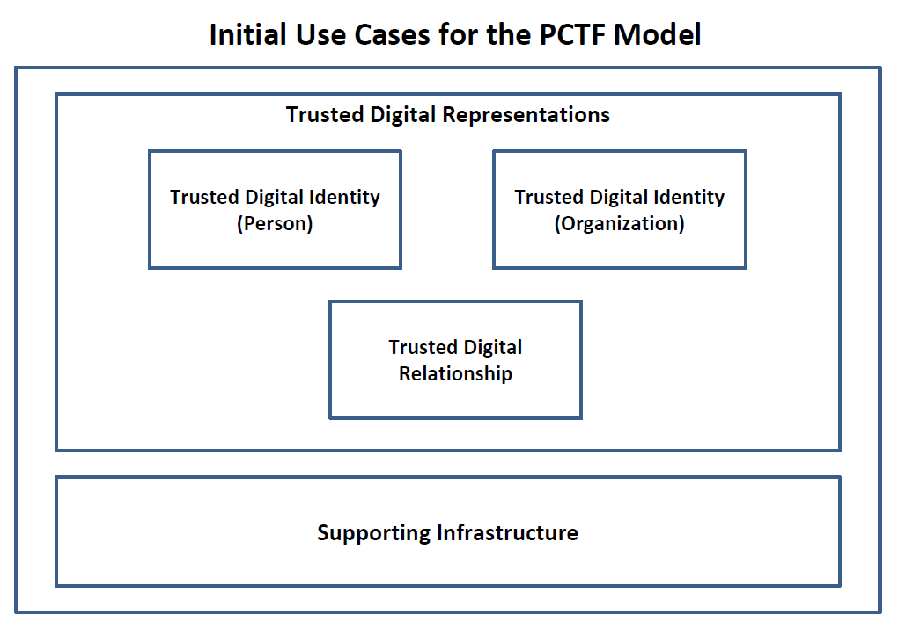

# Public Sector Profile of the Pan-Canadian Trust Framework Version 1.0 Document Version 0.5 dated May 30th, 2019

The detailed worksheet is hosted on Google Docs and can be found [here](https://docs.google.com/spreadsheets/d/1eukZkgdwXdskUlzaKR-cU3TjacunKY1OAyIRioFUnp8/edit?usp=sharing)

A quick recap of sequence of events leading up to this document version:

* In January 2019, weekly IMSC PCTF working group calls were established.  Work-in-progress material was circulated on a regular basis. 
* On February 26th, 2019, the IMSC met in person to discuss the ongoing work of the PCTF. 
* On March 28th, 2019, the IMSC PCTF Version 1.0 Document Version 0.4 Consultation Draft was released.
* During the period (March 28 to present), we received almost 200 comments, which we have reviewed and disposed in the attached version.

The public sector profile of the PCTF reflects:

1)	Evolution of the IMSC work – over the past year we have iterated the PCTF based on testing with provincial pilots. This document reflects our iteration and learnings.

2)	The Need to Apply the PCTF for Assessments. We have completed a provincial assessment and we are now undertaking another. For assessment purposes, we need to stabilize the PCTF as quickly as possible. We believe this version attached (and the associated worksheet) is sufficient to conduct an rigorous and transparent assessment process. While we recognize that we will continue to learn and adjust the PCTF, what we have now is of sufficient clarity for assessment. For additional rigour, the conformance criteria can now be entered into a requirements management tool, and into a proper change management process. 

3)	Policy Alignment. As you may be aware, Treasury Board of Canada approved the new Directive on Identity Management. This new directive, a major driver for the federal government, has new policy requirements based on the collaborative work the IMSC has done, dating back to what we agreed to as key digital identity concepts in April 2016. We are now executing against these requirements, and have always anticipated that the PCTF would become the key enabler for formalizing our assessment process (which is now the case).

We have disposed the majority of comments, but we have identified six high-level thematic issues that we need to continue to discuss and address as a working group. 

These thematic issues are summarized below:

### Thematic 1: The PCTF as a ‘trust framework’ and ‘trusted processes’

We took to heart the overuse of the word ‘trust’ and we reviewed the document to use the term more sparingly and with more precision. Section 5.3 is the primary manifestation of this scarcity and precision; we now define ‘atomic processes’ and ‘compound processes’ which only become ‘trusted processes’ only after a proper certification process. All said, the PCTF is really a detailed policy framework, that if used for an assessment process, can engender confidence, accountability and ultimately ‘trust’ as an outcome.

### Thematic 2: The PCTF as a set of ‘standards’
It is becoming clearer, that the PCTF is, rather, a set of agreed-on concepts and criteria, instead of a ‘standard’ itself. It is a ‘framework’ (as the name suggests) that helps situate existing standards (both business and technical) and relevant guidance and practices. That is the case at the federal level, where the trusted processes (and by extension, the conformance criteria) have been mapped to our own policy instruments, supporting guidelines, and technical interface standards.

### Thematic 3: The Evolving state of Credentials and Claims.
In developing the latest version of the PCTF, we have found ourselves in the middle of some very exciting developments around digital credentials and verifiable claims. There is a sea-change going in the industry – rethinking ‘information-sharing’ to ‘presenting digital claims’. There is also some exciting standards work going on at the W3C relating to verifiable credentials and decentralized identifiers.

Due to these new developments, we are now seeing the possibility that the traditional intermediated services (such as centralized/federated login providers) may disappear entirely due to new technological advancements. This may not happen in the near future, but we have adjusted our model to incorporate the broader notions of a ‘verifiable credential’ (more than a login) and to generalize to allow paper/plastic credentials (birth certificates, driver’s licences) to evolve digitally within our model. 

Of course, we are not sure we have it 100% right, but the interesting thing is -  we have ended up in the middle of these exciting developments and we seem to be moving into the lead as a country in understanding the implications of applying these technologies at ecosystem-scale (public and/or private). As such, we are getting lots of inquiries on how the PCTF might facilitate the migration to digital ecosystems, and to new standards-based digital credentials, open-standards verification systems, and international interoperability. Exciting.

### Thematic 4: Informed Consent

Consent is another evolving area, where we are not sure that we got it 100% right yet. We have incorporated material from DIACC and have adjusted for the public sector considerations. But there is considerable debate in the consent area, especially in what might need to change in legislation. Shortly, discussion papers will be released on how we might update legislation, relating to privacy, consent, and of course, digital identity. We fully expect the notion of consent to evolve, but for the meantime, we feel  that we have enough clarity in the PCTF to proceed with assessments, but ready to make changes if necessary.

### Thematic 5: More Detail to Come

Numerous comments were around the specific application of the PCTF. While we have a pretty good idea, we still don’t have all of the answers. Much of this detail (as we are discovering ) will be shaken out during the actual application of the PCTF (as we have done with Alberta). The PCTF is a framework, and as it is applied, it will likely be supplemented by detailed guidance, separate from the PCTF itself. We don’t know exactly what this will look like until we learn more through its application.

### Thematic 6: Scope of PCTF
We are beginning to incorporate the work that ISED is leading – Verified Organizations. Although, this version is focused of Persons, we are setting the stage for rapid (and consistent) incorporation of Verified Organization into this version of the PCTF

Some reviewers have highlighted that the scope of the PCTF can be broadened to include academic qualifications, professional designations, etc. We agree wholeheartedly. We are actually experimenting with pilots in the area with other countries. Keep in mind, that Digital identity is a very specific, but hugely important use case to get right first. We have anticipated ‘extensibility’ through the generalization of the models, and potential addition of more ‘atomic’ and ‘compound’ processes. We are not ready yet to entertain a broadened scope in the PCTF, but soon we will.

# Conclusion and Next Steps

All above said, please find attached the latest version and the detailed comment disposition document (of the 161 comments disposed).

The version attached reflects our best efforts to date in developing the public sector profile of the PCTF. It’s not perfect; it will require more iterations, evolution, and most importantly, stakeholder application and input. This PCTF version, or “public sector profile” has sufficient form and clarity to carry out an assessment process to accept trusted digital identities between jurisdictions. Granted, some of this assessment knowledge remains tacit (i.e., still in our heads, not written down) but that will be documented soon, incorporated into the PCTF or separate guidance.

The next immediate steps are to discuss the status of this document version at our next working group call. As editors, we believe that we can circulate one final time (with a two week review period) to catch and correct any errors/inconsistencies or capture any thematic issues that we need to carry forward as work into the future. Once
